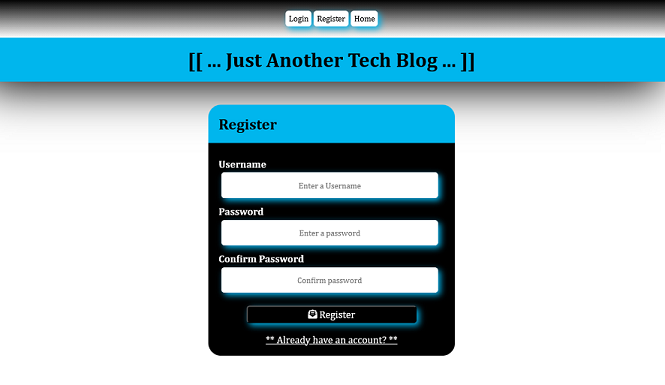

# mvc-tech-blog

A Model/View/Controller (MVC) blog application using Node, Handlebars, Postgres, Sequelize (ORM), and Sessions

## Description

A blog application having a home page to view blog articles and comments, plus a dashboard to create, update, or delete existing blog articles.
Features a register and login and keeps track of user session with automatic expiration after 2 hours.

## Table of Contents

- [General Functionality](#general-functionality)
- [Screenshots](#screen-shots)
- [Installation](#installation)
- [Usage](#usage)
- [Credits](#credits)
- [License](#licensing)
- [Contributing](#contributing)

### General Functionality

A user is able to go to the application and view existing blogs and any comments attached. The user may then login to create their own blog, modify their own blog(s), delete their own blog(s), and add comments to blogs. If the user doesn't already have an account they may register and then login. The user can logout at any time or the sytem will remove the session automatically after 2 hours.

### Screen Shots

#### Home

#### Register

#### Login

#### Dashboard (no blogs, yet)

#### New Blog

#### Dashboard (with blogs)

#### Edit/Delete Blog

#### Add Comment

#### Home (with blogs)

#### OOPS (Not logged in)

### Installation (manual)

1.  Install Node.js version 20.x or newer
2.  Clone https://github.com/ericroys-school/mvc-tech-blog.git
3.  `cd` into the `mvc-tech-blog` directory
4.  Run `npm i` to load all the project dependencies
5.  Install or have running an instance of postgresql (latest)
6.  Add your postgresql information to `.env.example` and then rename to `.env`
7.  Via psql run CREATE DATABASE `<`db name entered in your .env`>`;
8.  Run `npm run seed` to create the datamodel and relationships
9.  Run the program via `node server.js`

### Usage

As mentioned in the installation instructions, you run the program with `node server.js`. The app is then available via http://localhost:3001.

While it lasts, there is a free deployment available on [Render](https://mvc-tech-blog-z3bj.onrender.com)

Register a new user, login, and have fun.

### Credits

No kittens, puppies, armadillos, otter, or octopi were harmed in the making of this project.

### Licensing

As per always, this repo is licensed with [The Unlicense](http://choosealicense.com/licenses/unlicense) so feel free to do whatever. Share with your kids, dogs, neighbors, mail carrier, etc. Have a nice day!

### Contributing

Feel free to reach out via email @ eric.roys@gmail.com if you are interested in contributions to the project or have any kindly suggestions for improvements and/or enhancements. Tanks, Sherman!
